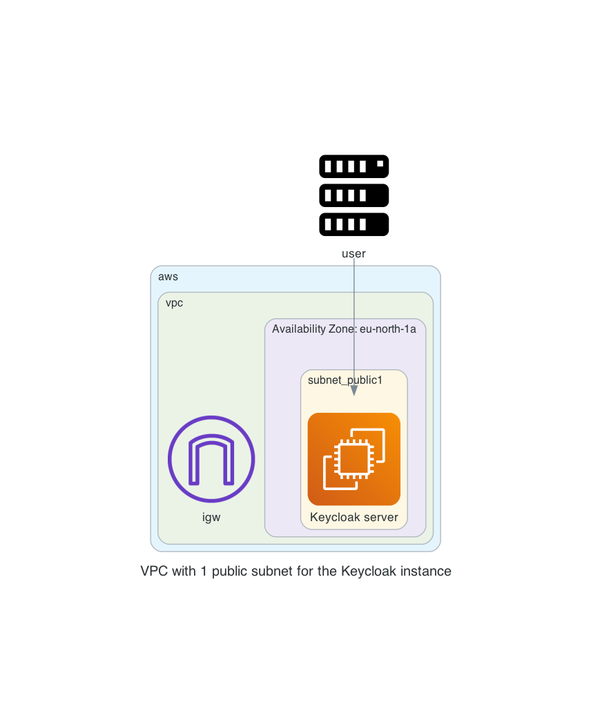
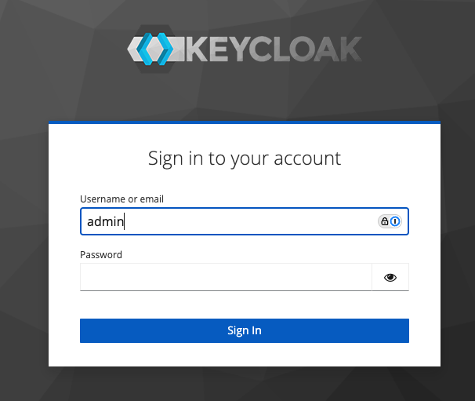

# keycloak

With this repository you will be able to have a keycloak running in AWS. Keycloak is an opensource SSO solution. This can be used in combination with applications

The Terraform code will do the following steps

- Generate TLS certificates with Let's Encrypt to be used by keycloak
- Create a VPC network with subnet, security group, internet gateway
- Create a EC2 instance on which has docker installed and a running keycloak container with a compose file found at `/opt/keycloak/compose.yaml`

# Diagram

  

# Prerequisites

## AWS
We will be using AWS. Make sure you have the following
- AWS account  


## Install terraform  
See the following documentation [How to install Terraform](https://learn.hashicorp.com/tutorials/terraform/install-cli)

## TLS certificate
You need to have valid TLS certificates that can be used with the DNS name you will be using to contact the keycloak instance.  
  
The repo assumes you have no certificates and want to create them using Let's Encrypt and that your DNS domain is managed under AWS. 

# How to

- Clone the repository to your local machine
```
git clone https://github.com/munnep/keycloak.git
```
- Go to the directory
```
cd keycloak
```
- Set your AWS credentials
```
export AWS_ACCESS_KEY_ID=
export AWS_SECRET_ACCESS_KEY=
export AWS_SESSION_TOKEN=
```
- create a file called `variables.auto.tfvars` with the following contents and your own values
```
tag_prefix                 = "keycloak"                         # TAG prefix for names to easily find your AWS resources
region                     = "eu-north-1"                    # Region to create the environment
vpc_cidr                   = "10.234.0.0/16"                 # subnet mask that can be used   
dns_hostname               = "keycloak"                         # DNS hostname for the keycloak
dns_zonename               = "aws.munnep.com"                # DNS zone name to be used
keycloak_admin_password    = "Password#1"                    # keycloak admin password for the dashboard 
certificate_email          = "patrick.munne@hashicorp.com"   # Your email address used by TLS certificate registration
public_key                 = "ssh-rsa AAAAB3Nza"             # The public key for you to connect to the server over SSH
```
- Terraform initialize
```
terraform init
```
- Terraform plan
```
terraform plan
```
- Terraform apply
```
terraform apply
```
- Terraform output should create 17 resources and show you the public dns string you can use to connect to the keycloak instance
```
Apply complete! Resources: 17 added, 0 changed, 0 destroyed.

Outputs:

keycloak_dashboard = "https://keycloak.aws.munnep.com"
keycloak_ip = "13.50.44.168"
ssh_keycloak_server = "ssh ubuntu@keycloak.aws.munnep.com"
```
- You can now login to the application with the username `admin` and password specified in your variables.



# extra note
Following is the docker run command to start keycloak container
```
docker run -p 443:443 -p 8080:8080 -v /var/tmp/server_certificate.pem:/var/tmp/server_certificate.pem -v /var/tmp/private_certificate.key:/var/tmp/private_certificate.key -e KEYCLOAK_ADMIN=admin -e KEYCLOAK_ADMIN_PASSWORD=Password1 quay.io/keycloak/keycloak:24.0.4 start-dev \
        --https-certificate-file=/var/tmp/server_certificate.pem \
        --https-certificate-key-file=/var/tmp/private_certificate.key \
        --https-port=443
```
